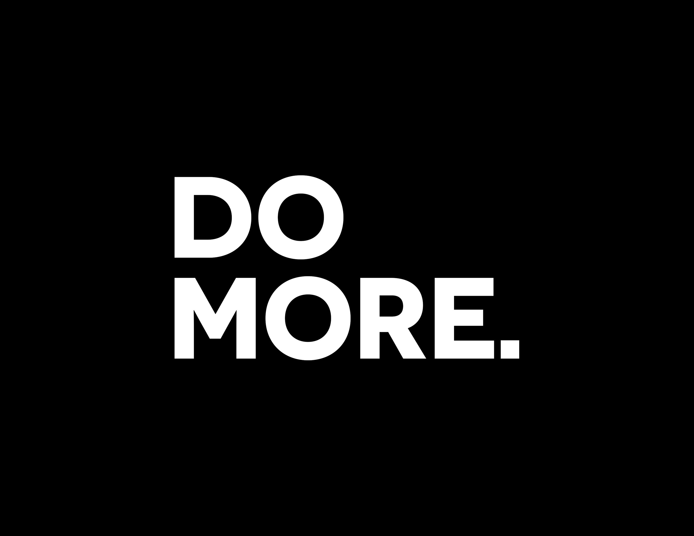

+++
title = "Work Life Balance"
slug = "work-life-balance"
date = 2021-03-24
+++

Hello there! This is an evolving piece around a rather large topic. Stay tuned for updates. 📻

## The Mantra

My mantra was "Do More". It's a quote by [Casey Neistat](https://www.youtube.com/user/caseyneistat). This was the phrase in my head to remind me I should be productive.

In retrospect, I misunderstood the meaning. I believe I used this to justify my overworking tendencies. Instead, "Do More" should be a reminder to push beyond your comfort bubble and challenge yourself.

## Loyalty & Honour

In a previous job, I was working long hours. I would work 8:00AM to 10:00PM most days. The pay was mediocre and the work itself was mundane. In the end of the day, I wore it like a badge of honour.

- "At least I'm loyal to the job.", I told myself.

When my grandfather passed away, I realized that the work wasn't as important as I initially made it out to be.

Work will carry on with or without you. If you're not there, someone else will replace you. Your time with your family is precious and finite.

## Glamorizing Overworking

When I saw [@KatyLeeson](https://twitter.com/KatyLeeson)'s post on overworking, I knew I had to write about this.

> We NEED to stop glamorizing overworking. The absence of sleep, good diet, exercise, relaxation, and time with friends and family isn't something to be applauded.

I think Katy and I share similar sentiments. It's important to note that the employer may also encourage or incentivize overworking habits.

Here's a fictitious example:

> We would like to acknowledge the heroes that worked day and night over the Christmas holidays to resolve `issue X`. Thank you Alice and Bob for stepping up and putting in all your hard work.

Beyond the technical issue, there's another problem. A lack of robustness allowed this scenario to happen as it did. A possible solution could have involved disabling the problematic feature temporarily while your staff is taking time off.

In the _acknowledgement_, the staff that sacrificed their time were labelled as "Heroes". They "Stepped Up".

This is dangerous for two reasons.

1. Encourages others to become "Heroes" as well. It _sounds_ positive.
2. Promotes the idea that only employees that sacrifice their time and well-being will be acknowledged for their work.

Everyone has different commitments in life. Married, kids, health issues and more. It's not okay to assume everyone has time to sacrifice.

## Burning Out

I've burned out in the past. A couple of times. Despite all the reading and reflecting, it will probably happen again. Heck, even the [Healthy Software Developer](https://www.youtube.com/watch?v=Ie6sSZQkUTM) is taking a hiatus. No one is immune to the stressors.

You matter. Take care of yourself.
